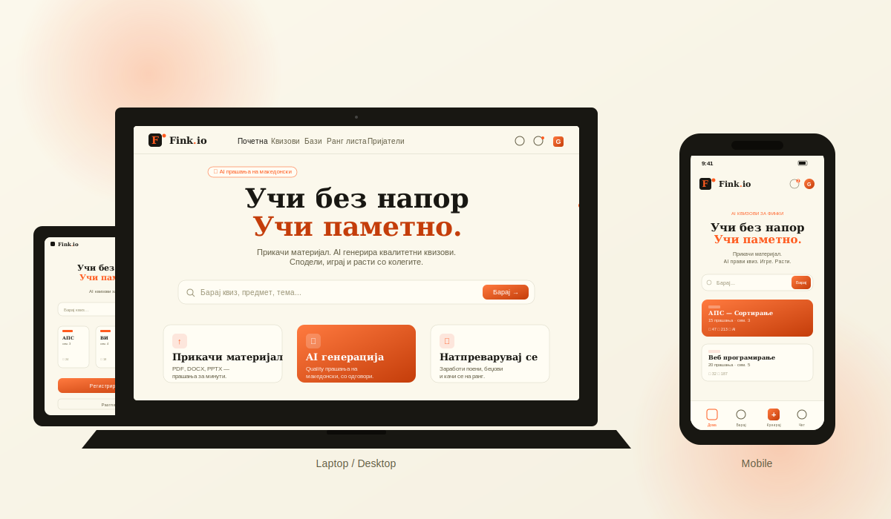
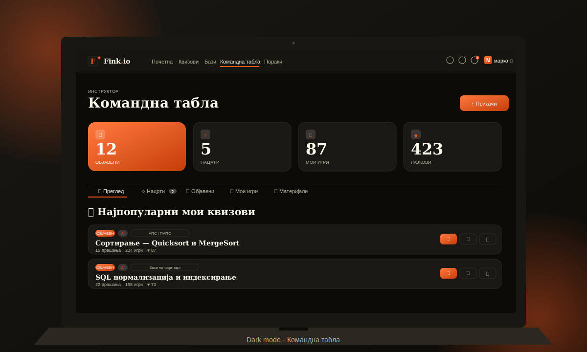
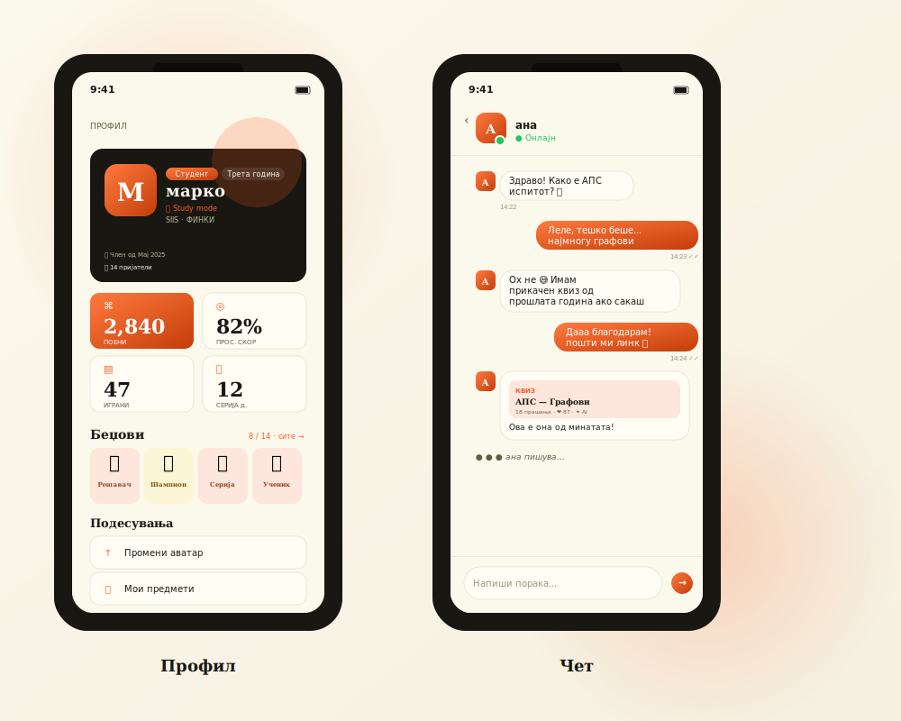
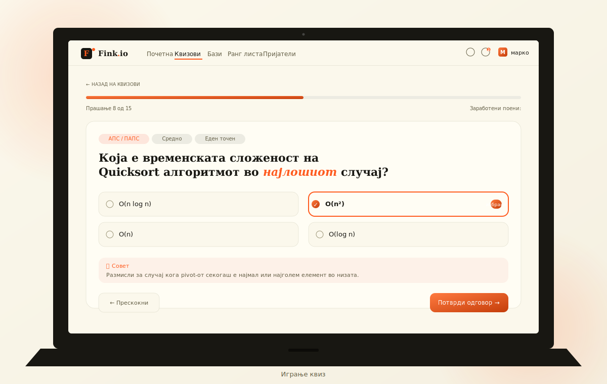

# Fink.io 🎓

**AI-powered platforma za квизови за студентите на ФИНКИ.**

Прикачи учебен материјал (PDF/DOCX/PPTX), а AI ќе генерира квалитетни прашања на македонски јазик. Учи, натпреварувај се, споделувај со колеги.



---

## 📸 Screenshots

### Светла тема — Homepage на сите уреди


### Темна тема — Командна табла (инструктор)


### Мобилна апликација — Профил и чет


### Играње квиз


---

## ✨ Што нуди Fink.io

### 📚 За студенти
- **Прикачи материјал** → AI генерира квиз за тебе (бесплатно, преку Google Gemini)
- **Игре квизови** на твојата година/семестар
- **Создавај** квизови мануелно (без AI)
- **Зачувај** омилени квизови и бази
- **Пријатели** со follow систем + WebSocket чет
- **Беџови, ранг листа, серии**

### 🎓 За инструктори
- Сè што и студентите, плюс:
- **Командна табла** со статистика
- **Аналитика** по квиз (просечен скор, дистрибуција)
- Привилегии за модерација

### 🛡️ За модератори / админи
- **Quiz reports** queue
- **Управување на корисници** (роли, бан)
- **Платформска аналитика**

---

## 🏗️ Tech Stack

### Backend
- **Python 3.12** + **Django 5**
- **Django REST Framework**
- **Django Channels + Daphne** (WebSocket за чет)
- **JWT auth** — 24h access, 30d refresh
- **Google Gemini API** (free tier, fallback: 2.5-flash-lite → 2.5-flash → 2.0-flash → 1.5-flash)
- **PostgreSQL** (production) / **SQLite** (dev)

### Frontend
- **React 18** + **Vite**
- **Tailwind CSS** со CSS variables за теми
- **Zustand** (state)
- **React Router v6**
- **Lucide React** (icons)

---

## 🚀 Setup за development (Windows)

### 1. Backend

```powershell
cd backend

python -m venv .venv
.venv\Scripts\activate

pip install -r requirements.txt

copy .env.example .env
# Уреди .env и стави го твојот GEMINI_API_KEY
```

**`.env` содржина:**
```
SECRET_KEY=django-insecure-dev-key
DEBUG=True
ALLOWED_HOSTS=localhost,127.0.0.1
DATABASE_URL=sqlite:///db.sqlite3

AI_PROVIDER=gemini
GEMINI_API_KEY=AIza...your_key_here
GEMINI_MODEL=gemini-2.5-flash-lite

CORS_ALLOWED_ORIGINS=http://localhost:5173
```

**Земи Gemini API клуч** бесплатно: https://aistudio.google.com/apikey

```powershell
python manage.py migrate
python manage.py createsuperuser
python manage.py seed_subjects        # засеј 170 предмети
python manage.py runserver            # стартува на Daphne ASGI
```

**Backend:** http://localhost:8000
**Admin:** http://localhost:8000/admin

> ⚠️ Бидејќи `daphne` е во INSTALLED_APPS, `runserver` користи ASGI (не WSGI). Тоа е потребно за WebSocket чет.

### 2. Frontend

```powershell
cd frontend
npm install
npm run dev
```

**Frontend:** http://localhost:5173

---

## 📂 Структура

```
fink_io/
├── backend/
│   ├── apps/
│   │   ├── accounts/     # User, Friendship, UserSubject
│   │   ├── materials/    # Subject, Material, SavedMaterial
│   │   ├── quizzes/      # Quiz, Question, Like, SavedQuiz, QuizAttempt
│   │   ├── ai_service/   # Gemini provider + text extraction
│   │   ├── analytics/    # UserStats + badges
│   │   ├── moderation/   # Report queue
│   │   ├── notifications/# Notification + signals
│   │   └── chat/         # WebSocket чет + presence
│   └── fink_io/
│       ├── settings.py
│       ├── urls.py
│       └── asgi.py       # ASGI (WebSocket + HTTP)
│
└── frontend/src/
    ├── App.jsx
    ├── index.css         # CSS variables (light/dark)
    ├── lib/
    │   ├── api.js
    │   ├── auth.js
    │   ├── theme.jsx
    │   └── chatSocket.js
    ├── components/       # Header, Footer, ThemeToggle, NotificationBell, ChatBadge, QuizCard, ...
    └── pages/            # Home, Profile, UserProfile, Friends, Messages, Search, Databases, Upload, CreateQuiz, ...
```

---

## 🎨 Дизајн систем

### Теми
3 моди: **Светло** ☀️ / **Темно** 🌙 / **Систем** 💻 — toggle во горниот десен агол.

### Tailwind семантички класи (theme-aware)
- `bg-bg`, `bg-surface`, `bg-elevated`
- `text-fg`, `text-muted`, `text-subtle`
- `border-border`
- `text-accent`, `bg-accent`

### Components
- `.card` — glassmorphism со backdrop blur
- `.card-hover`, `.card-dark`, `.card-accent`
- `.btn-primary`, `.btn-secondary`, `.btn-ghost`
- `.badge`, `.badge-accent`, `.badge-soft`
- `.input`, `.label`

### Шрифтови
- **Display:** Fraunces (serif, наслови)
- **Sans:** Manrope (UI)
- **Mono:** JetBrains Mono (meta)

---

## 🔐 Auth & улоги

JWT во localStorage, auto-refresh на 401. WebSocket автентификација преку `?token=...`.

| Role | Може |
|------|------|
| `guest` | гледа квизови, без login |
| `student` | + игра, прикачува, креира, чет, пријатели |
| `instructor` | + командна табла, аналитика |
| `moderator` | + quiz reports queue |
| `admin` | + сè |

---

## 🌐 API Endpoints (главни)

### Auth
```
POST   /api/auth/token/                login
POST   /api/auth/token/refresh/        refresh
POST   /api/accounts/register/         register
```

### Accounts + Friends
```
GET    /api/accounts/me/                                  мојот профил
PATCH  /api/accounts/me/                                  уреди (multipart за avatar)
GET    /api/accounts/me/subjects/                         мои предмети
GET    /api/accounts/me/friend-requests/                  pending барања
GET    /api/accounts/users/<id>/profile/                  јавен профил
POST   /api/accounts/users/<id>/friend-request/           испрати
POST   /api/accounts/friend-requests/<id>/respond/        accept/reject
DELETE /api/accounts/users/<id>/friend/                   отстрани
GET    /api/accounts/search/?q=...                        пребарувај корисници
```

### Materials (бази)
```
GET    /api/materials/databases/                          јавен каталог
GET    /api/materials/databases/by-user/<user_id>/        од одреден user
POST   /api/materials/                                    прикачи
POST   /api/materials/<id>/like/                          like toggle
POST   /api/materials/<id>/save/                          bookmark toggle
POST   /api/materials/<id>/download/                      track download
GET    /api/materials/saved/                              мои зачувани
```

### Quizzes
```
GET    /api/quizzes/                       листа + филтри (year, semester, subject, ordering)
GET    /api/quizzes/mine/                  мои
GET    /api/quizzes/saved/                 мои зачувани
POST   /api/quizzes/create/                мануелно
POST   /api/quizzes/generate/              AI генерирај од material_id
POST   /api/quizzes/<id>/publish/
POST   /api/quizzes/<id>/like/
POST   /api/quizzes/<id>/save/
GET    /api/quizzes/<id>/play/             играј (без correct)
POST   /api/quizzes/<id>/submit/           испрати одговори
GET    /api/quizzes/attempts/              моја историја
```

### Notifications
```
GET    /api/notifications/                 листа (?unread=1)
GET    /api/notifications/count/           непрочитани
POST   /api/notifications/<id>/read/
POST   /api/notifications/read-all/
```

### Chat (REST + WebSocket)
```
GET    /api/chat/conversations/                   мои разговори
POST   /api/chat/conversations/start/             {user_id}
GET    /api/chat/conversations/<id>/messages/
POST   /api/chat/conversations/<id>/read/
GET    /api/chat/unread-count/
GET    /api/chat/online-friends/

WS:    ws://localhost:8000/ws/chat/?token=<jwt>
```

**WebSocket events:**
- Send: `{type: 'send_message', conversation_id, body, temp_id}`
- Send: `{type: 'typing', conversation_id}`
- Receive: `{type: 'message', message: {...}}`
- Receive: `{type: 'message_confirmed', message: {...}}`
- Receive: `{type: 'typing', conversation_id, user_id}`
- Receive: `{type: 'presence', user_id, online}`
- Receive: `{type: 'connected', online_friends: [...]}`

---

## 🎮 Кориснички flow

### Прв квиз (студент)
1. `/register` → email/username/password → автоматски логиран
2. `/profile` → стави статус (Coffee ☕), година, аватар
3. `/upload` → drag&drop PDF
4. Опции:
   - **„Само зачувај како база"** → во `/databases` без квиз
   - **„Генерирај квиз"** → AI прави прашања (Gemini, ~10–30s)
5. Step 3: AI создава 1–3 квизови како нацрти
6. `/my-quizzes` → Нацрти → Уреди → Објави

### Пријатели + чет
1. `/users/<id>` → „Додај пријател"
2. Другиот добива нотификација (bell badge)
3. `/friends/Барања` → „Прифати"
4. „Порака" 💬 на профилот → отвара чет
5. `/messages` — real-time WebSocket, online dot, typing indicator

---

## 🎯 Беџови (14 типа × 4 нивоа)

| Беџ | Опис |
|-----|------|
| 🎯 Решавач | Број на одиграни (5/50/250/1000) |
| ⭐ Ученик | Просечен скор (50/70/85/95%) |
| 🏆 Шампион | Вкупни поени (50/500/2500/10000) |
| 🔥 Серија | Денови по ред (3/7/30/100) |
| 💯 Совршен | 100% на еден квиз |
| 📚 Знаење | Точни одговори (20/200/1000/5000) |
| ✍️ Креатор | Создадени квизови (инстр.) |
| ❤️ Омилен | Лајкови (инстр.) |
| 👑/🛡️/🎓 | Улога (admin/mod/instructor) |
| 👋 Добредојде | Регистриран |
| ⏳ Ветеран | Денови како член (30/90/180/365) |
| 🏃 Маратонец | 100+ квизови со >70% |
| 📅 Доследен | Серија ≥ 14 денови |

---

## 🚢 Production deploy (Render.com)

### Backend
1. Push на GitHub
2. Render → New → Web Service
3. **Build command:** `./build.sh`
4. **Start command:** `daphne fink_io.asgi:application -p $PORT -b 0.0.0.0`
   - ⚠️ Не gunicorn! Daphne е потребен за WebSocket
5. **Environment variables:**
   ```
   SECRET_KEY=<random>
   DEBUG=False
   ALLOWED_HOSTS=<your-app>.onrender.com
   DATABASE_URL=<auto>
   GEMINI_API_KEY=<your>
   CORS_ALLOWED_ORIGINS=https://<your-frontend>
   ```
6. Add **PostgreSQL** database

⚠️ За multi-instance scaling на чет, треба `channels-redis` + Redis. За сега `InMemoryChannelLayer` работи single-instance.

### Frontend
1. `npm run build`
2. Render Static Site, build dir `frontend/dist`
3. Env: `VITE_API_URL=https://<backend>.onrender.com/api`

---

## 🧰 Корисни команди

```powershell
# Backend
python manage.py seed_subjects                    # засеј (idempotent)
python manage.py createsuperuser
python manage.py shell

# Направи материјали јавни (старо)
python manage.py shell
>>> from apps.materials.models import Material
>>> Material.objects.all().update(visibility='public')

# Frontend
npm run dev
npm run build
npm run preview
```

---

## 🐛 Чести проблеми

### „Сите Gemini модели не успеаја: 503"
Google презафатени се. Системот пробува 4 модели + retries. Чекај 1–2 минути.

### WebSocket не се поврзува
- `daphne` мора да е во INSTALLED_APPS (прв)
- Лог треба да каже „Starting ASGI/Daphne version 4.x"

### Темната тема — текст и позадина се преклопуваат
Поправено — сите страници сега користат theme-aware класи (`bg-bg`, `text-fg`, итн.).

### Дупликат пораки во чет
Поправено — оптимистички render + server потврда со `temp_id` за dedup.

### Аватар не се прикажува
Аватарите се чуваат во `media/avatars/`. Django ги серви за dev. За production треба persistent storage (Render disk или S3).

---

## 👤 Автор

**Pazarkoski D.**
- 🌐 [pazarkoskid.github.io/portfolio](https://pazarkoskid.github.io/portfolio/)
- 📚 ФИНКИ, УКИМ

---

## 📜 License

Internal project. Не за commercial reuse без contact со авторот.
